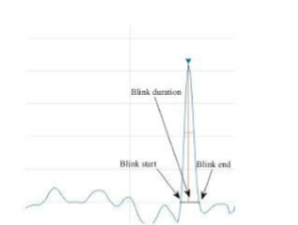
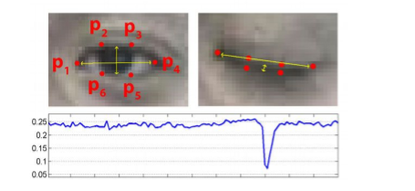

# Driver Drowsiness Detection System

A real-time driver drowsiness detection system using Python, OpenCV, and dlib.

## Applications
This can be used by drivers who tend to drive vehicles for longer periods of time that may lead to accidents due to drowsiness.

## Features
- Real-time face detection using dlib
- Eye landmark detection and tracking  
- Blink detection and analysis
- Drowsiness alert system with audio warning
- Video recording capability
- Histogram equalization for better performance in low light

## Dependencies
```
1) opencv-python
2) dlib
3) scipy
4) numpy
5) playsound
```

## Installation

### Prerequisites
1. Download the dlib face landmark model file:
   - Download `shape_predictor_68_face_landmarks.dat.bz2` from [here](http://dlib.net/files/shape_predictor_68_face_landmarks.dat.bz2)
   - Extract the `.dat` file and place it in the project directory

### Method 1: Using Conda (Recommended)
1. Install Miniforge/Conda if not already installed
2. Install the required dependencies using conda:
   ```bash
   conda install dlib opencv scipy numpy playsound -c conda-forge
   ```

### Method 2: Using Pip
```bash
pip install -r requirements.txt
```
Note: Installing dlib via pip may require additional build tools (CMake, Visual Studio Build Tools).

## Usage

Run the main script:
```bash
python blinkDetect.py
```

## Controls

- Press 'r' to reset the drowsiness detection state
- Press 'Esc' to exit the application

## Algorithm Description

A computer vision system made with the help of OpenCV that can automatically detect driver drowsiness in a real-time video stream and then play an alarm if the driver appears to be drowsy.

### Key Components:

● **Face Detection**: We utilize a pre-trained frontal face detector from Dlib's library which is based on a modification to the Histogram of Oriented Gradients in combination with Linear SVM for classification.

● **Landmark Detection**: The pre-trained facial landmark detector inside the dlib library is used to estimate the location of 68 (x, y)-coordinates that map to facial structures on the face.

● **Eye Aspect Ratio**: We calculate the aspect ratio to check whether eyes are opened or closed.
- The eye is open if Eye Aspect Ratio is greater than threshold (around 0.27)
- A blink is supposed to last 200-300 milliseconds
- A drowsy blink would last for 800-900 ms






## Files

- `blinkDetect.py` - Main drowsiness detection script with dlib
- `alarm.wav` - Audio alert file
- `shape_predictor_68_face_landmarks.dat` - dlib face landmark model (95MB)
- `eye.PNG`, `eye_aspect_ratio.PNG`, `face.PNG` - Documentation images

## Notes

- The system uses dlib's 68-point facial landmark detection for accurate eye tracking
- A conda environment is recommended for easy dlib installation
- The face landmark model file is required and included in the repository
